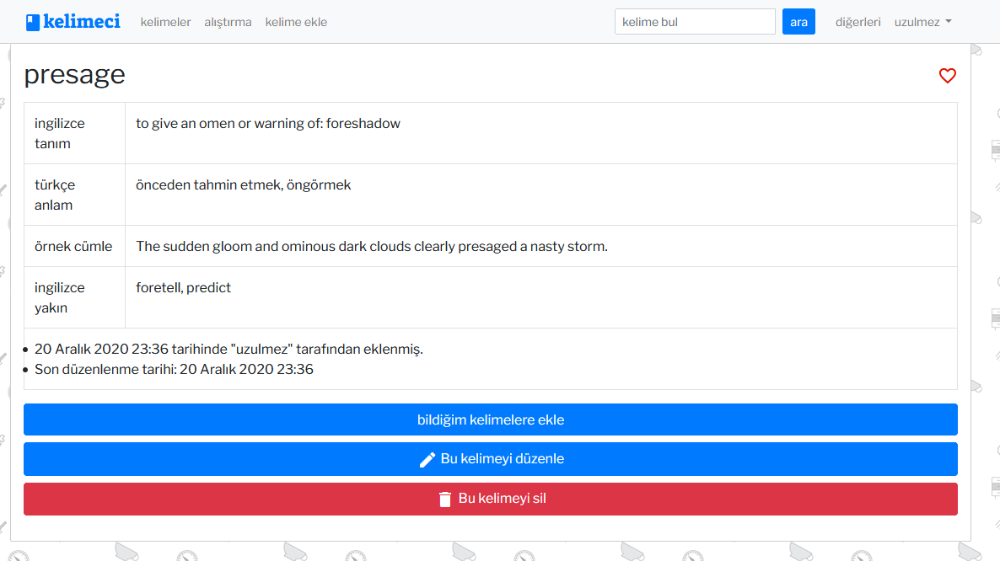

# kelimeci

A web application to practice English words socially.

This was the first Django project I build that had considerably
useful functionality. It served me as a playground as I discovered about
Django and Python more and more (in short, the codebase is a mess). This application
was supposed to  be used in a local (Turkish) environment wih 10-15 students
(with a supervising teacher) in an English learning classroom. The following features can be found:

* Collaborative word sharing, where users add words and meanings manually.
* A page to practice words by guessing the given random word.
* A word search functionality
* Known words and favorite words tracking
* User profiles with statistics about learned words, added words, 
favorite words etc. with some privacy settings.

Here are some screenshots:

